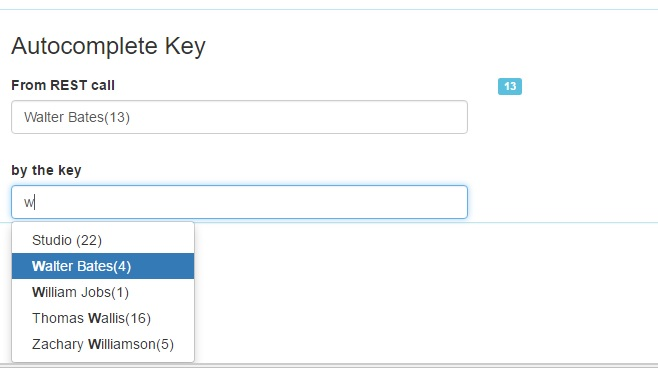

# widget_autocompletekey
The standard widget Auto Complete works from a list of Data. Users gives type some characters, and then a list of value appears.
User can then select the final value.
  The Standard Autocomplete use a list of Text, and return a Text.
 
 The Autocomplete key has the same behavior, except it return not a TEXT, but a KEY.
 
 
 
 
 For example, the list of available value may be :
 [  { "country" : "French", "code":"FR" }
	{ "country" : "Germany", "code":"GR" }
	{ "country" : "Italia", "code":"IT" }
	{ "country" : "Span", "code":"SP" }
	{ "country" : "England", "code":"EN" }
 ];
 then the user select Italia, the autocomplete key return "IT" as a result.
 The second advantage of the Automplete key (and it's the main one maybe !) is it's able to display the value "Italia" when the variable contains "IT". So, you can save in the process variable (or the BDM) the code IT. When you want to diplay it on the form, just give "IT" to the widget : it will display Italia to the user.
 
 So, for this point of view, the autocomplete key works like a Select Widget.
 Nota : the autocomplet key return only a Key. So it's not possible to the user to give "My new country" in the widget (in this situation, the widget return a "null" key), where the standard autocomplete return the text (because the standard autocomplete is only here to help the user to give a text).
 
 # How to install the widget in the UIDesigner?
 Check the procedure in the Bonitasoft documentation here:
https://documentation.bonitasoft.com/bonita/7.11/_using-the-ui-designer

The procedure to use is the classical one with the UI Designer when you want to integrate a component:

1/ open the UI Designer,
2/ Click on "Import",
3/ give the ZIP that you downloaded
That's it, the widget should be visible on the Widget panel.
